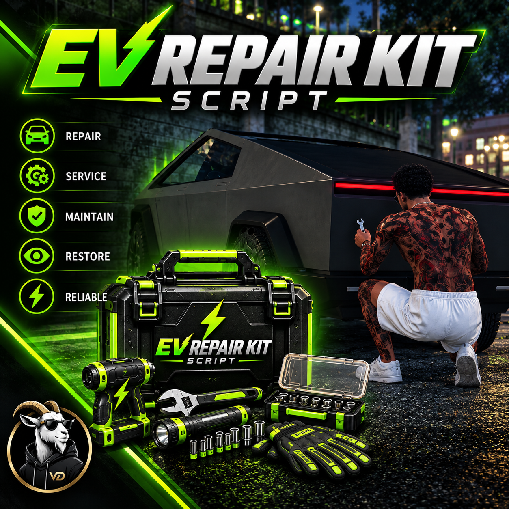

# Vision Development Studio - EV Repair Kit

A free, editable FiveM resource that gives electric vehicles their own repair-kit workflow. It is useful for custom EVs that do not expose a conventional engine bone and therefore fail traditional "stand near the engine" repair checks.



## Features

- Dedicated `ev_repair_kit` item for `ox_inventory`
- EV model allowlist with easy custom vehicle support
- Does not depend on a traditional engine bone
- Prompt to take a small adjustable wrench
- Player walks to the rear of the EV and presses **Enter** to repair
- Repair animation and progress UI
- Configurable repair duration and target repair percentage
- Optional visible dent/body deformation repair
- Kit is consumed only after a successful repair
- Fully editable source

## Dependencies

- `ox_lib`
- `ox_inventory`

## Installation

1. Rename the downloaded folder to `vd-evrepair`.
2. Place it in your server resources directory.
3. Copy `images/ev_repair_kit.png` into your `ox_inventory/web/images/` folder.
4. Add the item definition below to `ox_inventory/data/items.lua`.
5. Add the resource to `server.cfg` after its dependencies.
6. Add any custom EV spawn names to `Config.ElectricVehicles` in `config.lua`.
7. Restart `ox_inventory` and `vd-evrepair`, or restart the server.

### ox_inventory item

```lua
['ev_repair_kit'] = {
    label = 'EV Repair Kit',
    weight = 1000,
    stack = true,
    close = true,
    description = 'A specialized repair kit designed for electric vehicles.',

    client = {
        image = 'ev_repair_kit.png',
        event = 'vd-evrepair:client:useKit'
    }
},
```

### server.cfg

```cfg
ensure ox_lib
ensure ox_inventory
ensure vd-evrepair
```

## Configuration

The main settings are in `config.lua`.

### Add custom EVs

```lua
Config.ElectricVehicles = {
    'your_custom_ev',
    'another_ev',
    -- existing/default EVs...
}
```

Use the vehicle's **spawn/model name**, not its display label.

### Repair percentage

```lua
Config.RepairPercentage = 1.00 -- 100%
```

Examples:

```lua
Config.RepairPercentage = 0.85 -- target 85%
Config.RepairPercentage = 0.75 -- target 75%
Config.RepairPercentage = 0.50 -- target 50%
```

The script will not lower a vehicle that is already healthier than the configured target.

### Visual body repair

```lua
Config.RepairVisualDamage = true
```

When enabled, visible dents/body deformation are restored. GTA does not expose a clean percentage-based dent restoration system, so visible deformation is restored fully while `Config.RepairPercentage` controls the mechanical target health.

### Repair duration

```lua
Config.RepairDuration = 10000 -- milliseconds; 10 seconds
```

### Rear interaction

```lua
Config.RearInteractionDistance = 1.8
Config.RearExtraOffset = 0.35
Config.RearZOffset = 0.0
```

If a custom vehicle's interaction point is too close to or too far behind the bumper, adjust `RearExtraOffset`.

### Repair tool

The default prop is the smaller silver adjustable wrench:

```lua
Config.RepairTool = {
    model = 'prop_tool_adjspanner',
    bone = 57005,
    pos = vec3(0.11, 0.02, -0.02),
    rot = vec3(-95.0, 5.0, 5.0)
}
```

## Player flow

Use **EV Repair Kit** near an allowed EV → take the wrench → walk to the rear of the vehicle → press **Enter** → complete the repair → kit is consumed after success.

## Troubleshooting

**The item does nothing:** Confirm the item event is `vd-evrepair:client:useKit`, the resource is started, and `ox_lib`/`ox_inventory` start first.

**Vehicle is not recognized:** Add its exact spawn/model name to `Config.ElectricVehicles` or set `Config.AllowAllVehicles = true` for testing only.

**Rear prompt is in the wrong place:** Adjust `Config.RearExtraOffset`, `Config.RearInteractionDistance`, or `Config.RearZOffset`.

**Vehicle health changes but dents remain:** Set `Config.RepairVisualDamage = true`.

**Inventory image is missing:** Confirm `ev_repair_kit.png` is inside `ox_inventory/web/images/` and that the item definition uses `image = 'ev_repair_kit.png'`.

## License

Free to use and modify on your own FiveM server. Resale and standalone redistribution/re-uploading are prohibited. Share the official Vision Development repository/release link instead. See [`LICENSE`](LICENSE) for the full terms.

## Credits

Developed by **Vision Development**.
